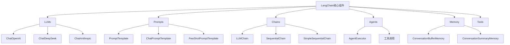
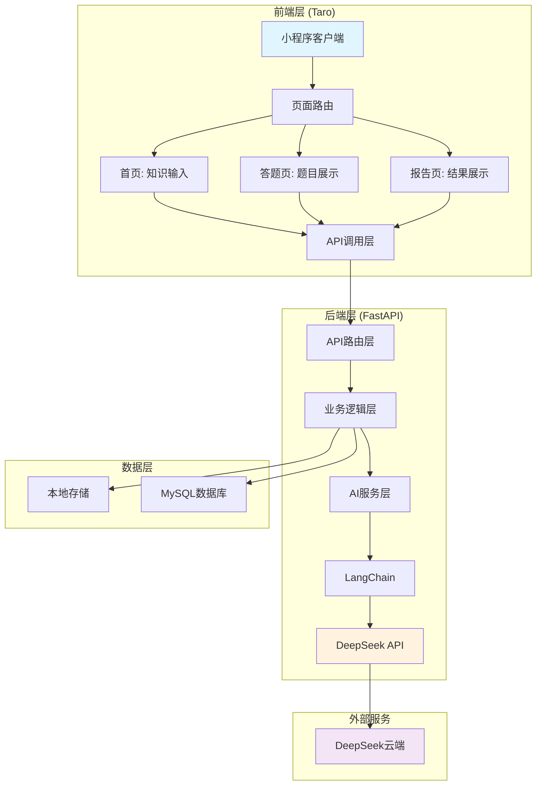
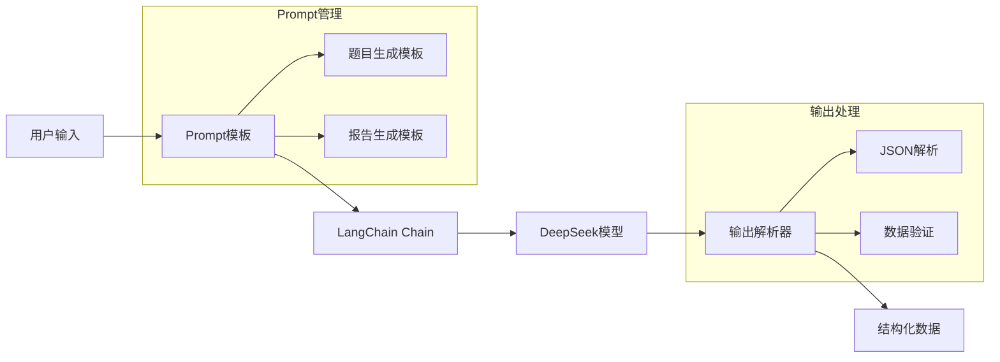
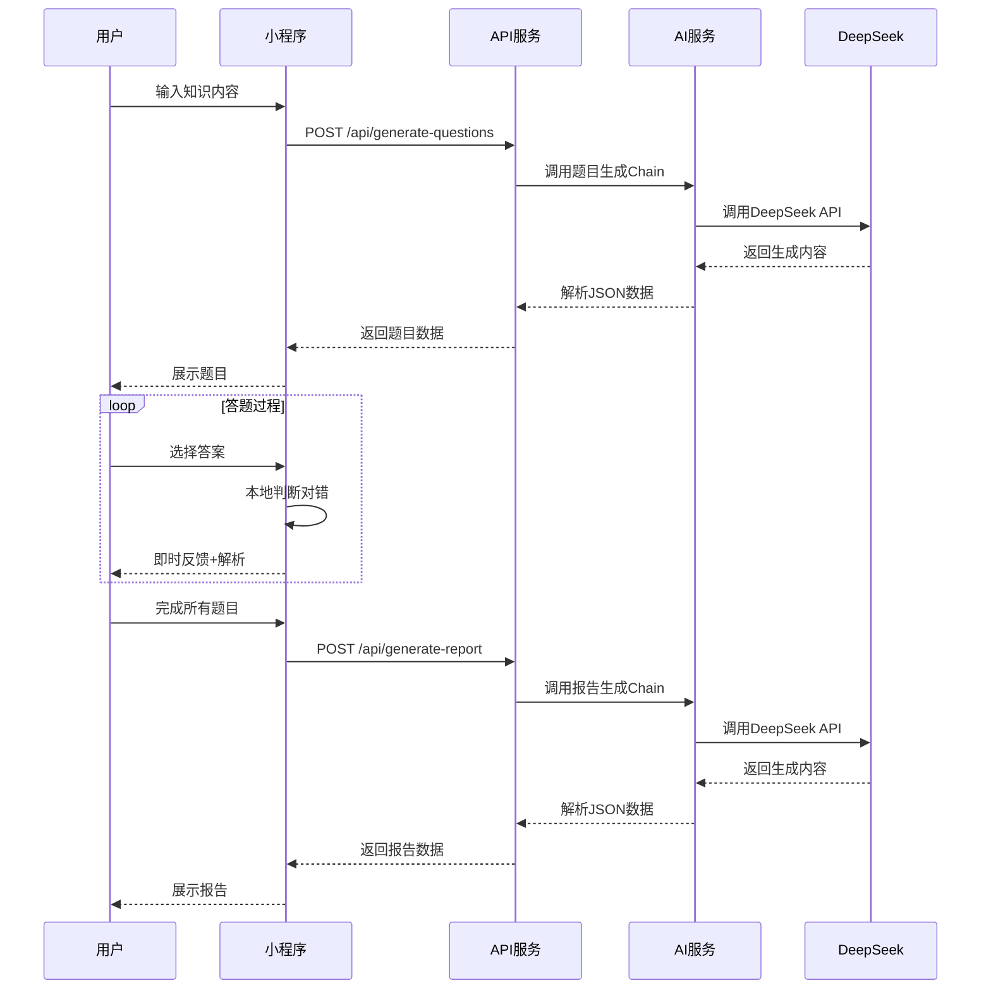
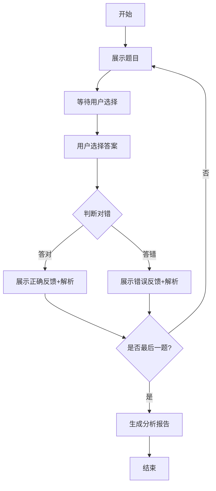
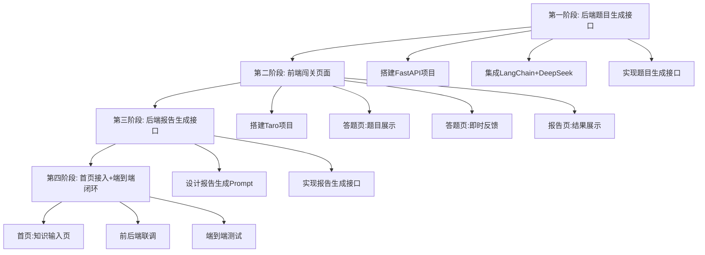
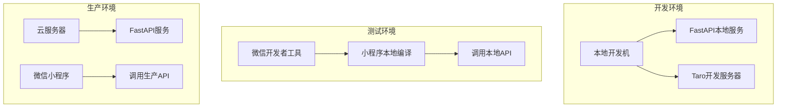

# 《yuAIRUN小程序》方案设计文档

---

## 第一章：项目概述

### 1.1 项目背景与目标

#### 背景
现代学习者面临"信息过载"与"学习动力不足"的双重痛点。传统的学习方式往往枯燥乏味，难以保持持续的学习动力。yuAIRUN小程序旨在利用AI技术，将非结构化的海量信息瞬间转化为结构化、趣味性的问答游戏，让学习变得像闯关一样有趣。

#### 核心目标
1. **短期目标（MVP阶段）**：跑通"用户输入内容 → AI生成题目 → 用户答题 → AI生成分析报告"的核心闭环
2. **中期目标**：扩展输入源（文档、网页、视频）、引入RAG私有知识库、完善用户系统
3. **长期目标**：构建完整的AI学习生态，支持多模态交互、社交对战、商业化变现

### 1.2 产品定位与核心价值

#### 产品定位
**深度集成于微信生态的学习小程序，主打"万物皆可闯关"**

#### 核心价值
| 价值维度 | 具体描述 |
|----------|----------|
| **学习效率** | AI自动将任意知识转化为结构化题目，节省整理时间 |
| **学习趣味** | 游戏化闯关机制，答对获得经验值奖励，激发学习动力 |
| **知识巩固** | 即时反馈+深度解析，答错也能学到知识 |
| **社交裂变** | 微信生态分享，学习报告海报，形成社交传播 |
| **个性化** | 基于答题数据的个性化分析和复盘报告 |

### 1.3 MVP范围定义与简化策略

#### MVP核心策略
**最短路径跑通核心学习闭环**，而不是功能全面。

#### 核心闭环
```
用户输入内容 → AI生成题目 → 用户答题 → AI生成分析报告
```

#### MVP阶段简化策略

| 模块 | MVP策略 | 说明 |
|------|---------|------|
| 联网搜索 | ❌ 暂不实现 | AI直接基于用户输入生成题目，不扩展知识 |
| 用户系统 | ❌ 暂不实现 | 使用本地存储，无需登录注册 |
| 数据库建模 | ❌ 暂不实现 | 数据存本地，MVP验证后再设计数据库 |
| 多模态 | ❌ 暂不实现 | 纯文本交互，后续再加图片/语音 |
| 分享海报 | ⚠️ 简化实现 | 基础文本分享，不依赖Canvas复杂绘制 |

#### MVP聚焦功能

| 功能 | 优先级 | 实现方式 |
|------|--------|----------|
| 知识输入 | P0 | 简单文本输入框 |
| AI生成题目 | P0 | LangChain + DeepSeek |
| 答题交互 | P0 | Taro前端页面 |
| 即时反馈 | P0 | 答对/答错展示解析 |
| 分析报告 | P0 | LangChain生成报告 |
| 经验值系统 | P1 | 本地计算，简单展示 |
| 基础分享 | P1 | 微信原生分享 |

### 1.4 预期成果与成功指标

#### MVP阶段成功指标
| 指标 | 目标值 | 说明 |
|------|--------|------|
| 核心流程跑通 | 100% | 输入→出题→答题→报告完整闭环 |
| AI响应时间 | <10秒 | 题目生成和报告生成的响应时间 |
| 题目质量 | 可用 | 生成的题目逻辑正确、选项合理 |
| 用户体验 | 流畅 | 页面切换流畅，无明显卡顿 |

---

## 第二章：技术选型分析

### 2.1 前端框架选型：Taro

#### 2.1.1 小程序跨端框架对比

在小程序开发领域，主要有以下几个跨端框架可供选择：

| 框架 | 开发方 | 核心语法 | 支持平台 | 特点 |
|------|--------|----------|----------|------|
| **Taro** | 京东 | React/Vue | 微信/支付宝/百度/字节/QQ/京东小程序、H5、React Native | React生态强大，TypeScript支持好 |
| **uni-app** | DCloud | Vue | 12+小程序平台、H5、App(Android/iOS/鸿蒙) | 生态成熟，插件市场丰富，支持平台最广 |
| **Kbone** | 微信官方 | Web | 微信小程序 | 适配已有Web项目 |
| **Remax** | 阿里 | React | 微信/支付宝/钉钉小程序 | 真实React渲染，非DSL编译 |
| **Mpx** | 滴滴 | 增强型小程序 | 微信小程序 | 性能优秀，原生小程序增强 |

#### 2.1.2 Taro vs uni-app 详细对比

| 对比维度 | Taro | uni-app | 推荐 |
|----------|------|---------|------|
| **语法偏好** | React（主流趋势） | Vue（国内流行） | 取决于团队技术栈 |
| **TypeScript支持** | ⭐⭐⭐⭐⭐ 原生支持 | ⭐⭐⭐⭐ 支持较好 | Taro略优 |
| **生态成熟度** | ⭐⭐⭐⭐ | ⭐⭐⭐⭐⭐ 插件市场更丰富 | uni-app略优 |
| **跨端能力** | ⭐⭐⭐⭐ 支持主流平台 | ⭐⭐⭐⭐⭐ 支持平台最多 | uni-app略优 |
| **性能表现** | ⭐⭐⭐⭐ 编译优化好 | ⭐⭐⭐⭐ 性能持续优化 | 持平 |
| **鸿蒙支持** | ⭐⭐⭐ 适配中 | ⭐⭐⭐⭐ 已支持 | uni-app略优 |
| **社区活跃度** | ⭐⭐⭐⭐ | ⭐⭐⭐⭐⭐ 国内更活跃 | uni-app略优 |
| **学习曲线** | React开发者友好 | Vue开发者友好 | 取决于背景 |

#### 2.1.3 选择Taro的理由

1. **React生态优势**：React是全球最流行的前端框架之一，生态成熟，社区庞大
2. **TypeScript原生支持**：Taro对TypeScript支持非常好，适合大型项目开发
3. **京东持续维护**：作为京东官方项目，有稳定的维护和更新
4. **跨端能力足够**：支持微信小程序（主要目标平台）+ H5 + React Native
5. **性能表现优秀**：编译优化好，运行时性能表现优秀
6. **未来扩展性好**：React Native支持后续App开发需求

#### 2.1.4 Taro核心特性

| 特性 | 说明 |
|------|------|
| React 18支持 | 支持Concurrent Mode、Suspense等新特性 |
| Vite构建 | 支持Vite作为构建工具，编译速度更快 |
| TypeScript | 原生支持TypeScript，类型安全 |
| 跨端统一 | 一套代码，多端运行 |
| 插件系统 | 灵活的插件扩展机制 |
| 虚拟列表 | 内置虚拟列表组件，优化长列表性能 |

### 2.2 后端技术栈选型：Python + FastAPI

#### 2.2.1 后端框架对比

| 框架 | 语言 | 特点 | 适合场景 |
|------|------|------|----------|
| **FastAPI** | Python | 异步支持好，性能优秀，自动API文档 | AI应用、高性能API |
| **Flask** | Python | 轻量灵活，扩展丰富 | 中小型项目 |
| **Django** | Python | 全功能框架，自带ORM/ admin | 大型复杂项目 |
| **Express** | Node.js | 轻量快速，生态丰富 | 实时应用、微服务 |
| **Spring Boot** | Java | 企业级框架，稳定可靠 | 大型企业应用 |

#### 2.2.2 选择Python + FastAPI的理由

1. **AI生态契合度高**
   - Python是AI/ML领域的首选语言
   - LangChain、OpenAI SDK等AI库都是Python优先
   - 数据处理、模型调用等AI相关操作更便捷

2. **FastAPI性能优秀**
   - 基于Starlette和Pydantic，性能接近Node.js/Go
   - 原生异步支持，适合IO密集型任务（如AI API调用）
   - 自动API文档生成（Swagger UI），方便调试

3. **开发效率高**
   - 类型提示+自动验证，减少 boilerplate 代码
   - 热重载支持，开发体验好
   - 社区活跃，文档完善

4. **MVP阶段适合**
   - 快速原型开发
   - 轻量级，启动快
   - 易于部署和扩展

#### 2.2.3 FastAPI核心特性

| 特性 | 说明 |
|------|------|
| 异步支持 | 原生async/await，高并发性能 |
| 自动文档 | 自动生成Swagger UI和ReDoc |
| 类型安全 | 基于Pydantic的数据验证 |
| 依赖注入 | 内置依赖注入系统 |
| WebSocket | 原生WebSocket支持 |
| CORS | 内置跨域支持 |

### 2.3 AI框架选型：LangChain

#### 2.3.1 AI框架对比

| 框架 | 特点 | 适合场景 |
|------|------|----------|
| **LangChain** | LLM应用开发框架，组件丰富，社区活跃 | 复杂AI编排、Chain组合 |
| **LlamaIndex** | 数据框架，专注于RAG和数据索引 | 知识库问答、数据检索 |
| **Semantic Kernel** | 微软出品，企业级AI编排 | 企业应用、.NET生态 |
| **Haystack** | 深度学习框架，专注于NLP管道 | 文档问答、信息抽取 |

#### 2.3.2 选择LangChain的理由

1. **组件化设计**
   - LLMs：语言模型抽象层
   - Prompts：提示词模板管理
   - Chains：链式调用编排
   - Agents：智能代理决策（MVP阶段暂不使用）
   - Memory：对话状态管理

2. **MVP阶段简化使用**
   - ✅ PromptTemplate - 管理提示词模板
   - ✅ ChatDeepSeek - DeepSeek模型集成
   - ✅ OutputParser - 解析JSON输出
   - ✅ Simple Chain - 串联输入→模型→输出

3. **生态丰富**
   - 支持多种LLM提供商（OpenAI、DeepSeek、Claude等）
   - 丰富的工具和集成
   - 社区活跃，文档完善

4. **未来扩展性好**
   - 支持RAG、Agent等高级功能
   - 可以逐步引入更复杂的AI编排
   - 便于后续功能迭代

#### 2.3.3 LangChain核心组件介绍



### 2.4 AI大模型选型：DeepSeek

#### 2.4.1 主流大模型对比

| 模型 | 提供商 | 特点 | 价格 | 适合场景 |
|------|--------|------|------|----------|
| **DeepSeek** | 深度求索 | 国产大模型，性价比高，中文能力强 | 低价 | 中文应用、成本敏感 |
| **GPT-4** | OpenAI | 能力最强，生态完善 | 高价 | 复杂任务、高质量要求 |
| **Claude** | Anthropic | 安全性好，长文本支持 | 中价 | 长文本、安全敏感 |
| **文心一言** | 百度 | 国产大模型，中文能力强 | 中价 | 中文应用、百度生态 |
| **通义千问** | 阿里 | 国产大模型，多模态支持 | 中价 | 中文应用、阿里生态 |

#### 2.4.2 选择DeepSeek的理由

1. **性价比高**
   - 价格远低于GPT-4，适合MVP阶段成本控制
   - 支持按量付费，灵活计费

2. **中文能力强**
   - 针对中文优化，中文理解和生成能力强
   - 适合中文学习场景

3. **能力足够**
   - 支持Function Calling，可以结构化输出
   - 支持长上下文（128K），适合处理长文本
   - 推理能力强，适合生成高质量题目

4. **国内访问友好**
   - 国内服务器，访问速度快
   - 无需科学上网，稳定可靠

5. **LangChain集成好**
   - 官方支持langchain-deepseek包
   - 兼容OpenAI接口，迁移方便

#### 2.4.3 DeepSeek模型能力

| 能力 | 说明 |
|------|------|
| 文本生成 | 高质量的中文文本生成 |
| 代码生成 | 支持多种编程语言 |
| 推理能力 | 逻辑推理和数学计算 |
| Function Calling | 支持工具调用和结构化输出 |
| 长上下文 | 支持128K上下文窗口 |
| 多轮对话 | 支持上下文记忆 |

#### 2.4.4 DeepSeek API调用方式

```python
# 方式一：通过OpenAI兼容接口
from langchain_openai import ChatOpenAI

llm = ChatOpenAI(
    model="deepseek-chat",
    openai_api_key="your-api-key",
    openai_api_base="https://api.deepseek.com",
    temperature=0.7
)

# 方式二：使用langchain-deepseek包
from langchain_deepseek import ChatDeepSeek

llm = ChatDeepSeek(
    model="deepseek-chat",
    api_key="your-api-key",
    temperature=0.7
)
```

### 2.5 数据库选型：MySQL（MVP阶段暂不使用）

#### 2.5.1 数据库对比

| 数据库 | 类型 | 特点 | 适合场景 |
|--------|------|------|----------|
| **MySQL** | 关系型 | 成熟稳定，生态完善 | 结构化数据、事务处理 |
| **PostgreSQL** | 关系型 | 功能丰富，扩展性强 | 复杂查询、地理数据 |
| **MongoDB** | 文档型 | 灵活 schema，易扩展 | 半结构化数据、快速迭代 |
| **Redis** | 键值型 | 高性能，支持多种数据结构 | 缓存、会话、实时数据 |

#### 2.5.2 MVP阶段数据存储方案

MVP阶段采用**本地存储**方案，不引入数据库：

| 存储方式 | 用途 | 说明 |
|----------|------|------|
| **小程序本地存储** | 用户答题数据、经验值 | wx.setStorageSync/wx.getStorageSync |
| **内存存储** | 临时题目数据、会话状态 | 服务端内存，重启丢失 |

#### 2.5.3 后续阶段数据库设计

验证MVP后，引入MySQL数据库：

| 表名 | 用途 | 核心字段 |
|------|------|----------|
| users | 用户表 | id, openid, nickname, avatar, created_at |
| questions | 题目表 | id, user_id, content, questions_json, created_at |
| answers | 答题记录表 | id, user_id, question_id, answer, is_correct, created_at |
| reports | 报告表 | id, user_id, question_id, report_json, created_at |

### 2.6 其他技术组件

| 组件 | 选择 | 用途 |
|------|------|------|
| **包管理** | npm/yarn | 前端依赖管理 |
| **包管理** | pip/poetry | 后端依赖管理 |
| **API文档** | Swagger UI (FastAPI自动生成) | API调试和文档 |
| **跨域处理** | FastAPI CORS中间件 | 前后端跨域请求 |
| **环境变量** | python-dotenv | 配置管理 |
| **日志** | Python logging | 日志记录 |

---

## 第三章：系统架构设计

### 3.1 整体架构图



### 3.2 前端架构设计（Taro）

#### 3.2.1 项目结构

```
yuAIRUN-miniapp/
├── config/                 # Taro配置文件
│   ├── index.js           # 主配置
│   ├── dev.js             # 开发环境配置
│   └── prod.js            # 生产环境配置
├── src/
│   ├── app.ts             # 应用入口
│   ├── app.config.ts      # 应用配置
│   ├── pages/             # 页面目录
│   │   ├── index/         # 首页（知识输入）
│   │   │   ├── index.tsx
│   │   │   ├── index.config.ts
│   │   │   └── index.scss
│   │   ├── quiz/          # 答题页
│   │   │   ├── index.tsx
│   │   │   ├── index.config.ts
│   │   │   └── index.scss
│   │   └── report/        # 报告页
│   │       ├── index.tsx
│   │       ├── index.config.ts
│   │       └── index.scss
│   ├── components/        # 公共组件
│   │   ├── QuestionCard/  # 题目卡片组件
│   │   ├── OptionItem/    # 选项组件
│   │   ├── ProgressBar/   # 进度条组件
│   │   └── ResultCard/    # 结果卡片组件
│   ├── services/          # API服务层
│   │   ├── api.ts         # API封装
│   │   └── request.ts     # 请求工具
│   ├── store/             # 状态管理
│   │   ├── index.ts       # Store入口
│   │   ├── quiz.ts        # 答题状态
│   │   └── user.ts        # 用户状态
│   ├── utils/             # 工具函数
│   │   ├── storage.ts     # 本地存储工具
│   │   └── format.ts      # 格式化工具
│   └── assets/            # 静态资源
│       ├── images/        # 图片资源
│       └── styles/        # 全局样式
├── package.json
├── tsconfig.json
└── project.config.json    # 微信小程序项目配置
```

#### 3.2.2 页面路由设计

| 页面 | 路径 | 功能 |
|------|------|------|
| 首页 | /pages/index/index | 知识输入，开始生成按钮 |
| 答题页 | /pages/quiz/index | 题目展示，选项选择，即时反馈 |
| 报告页 | /pages/report/index | 结果展示，知识总结，分享按钮 |

#### 3.2.3 状态管理设计

使用Taro内置的状态管理（或引入Zustand）：

```typescript
// store/quiz.ts
interface QuizState {
  questions: Question[];       // 题目列表
  currentIndex: number;        // 当前题目索引
  answers: UserAnswer[];       // 用户答案
  score: number;               // 得分
  experience: number;          // 经验值
  isCompleted: boolean;        // 是否完成
}

// actions
- setQuestions(questions)
- nextQuestion()
- submitAnswer(answer)
- calculateScore()
- resetQuiz()
```

### 3.3 后端架构设计

#### 3.3.1 项目结构

```
yuAIRUN-backend/
├── app/
│   ├── __init__.py
│   ├── main.py              # FastAPI应用入口
│   ├── config.py            # 配置管理
│   ├── api/                 # API路由
│   │   ├── __init__.py
│   │   ├── endpoints/
│   │   │   ├── questions.py # 题目生成接口
│   │   │   └── reports.py   # 报告生成接口
│   │   └── deps.py          # 依赖注入
│   ├── core/                # 核心模块
│   │   ├── __init__.py
│   │   ├── security.py      # 安全相关
│   │   └── logging.py       # 日志配置
│   ├── models/              # 数据模型
│   │   ├── __init__.py
│   │   ├── question.py      # 题目模型
│   │   └── report.py        # 报告模型
│   ├── services/            # 业务逻辑
│   │   ├── __init__.py
│   │   ├── ai_service.py    # AI服务
│   │   └── question_service.py
│   └── schemas/             # Pydantic模型
│       ├── __init__.py
│       ├── question.py      # 题目Schema
│       └── report.py        # 报告Schema
├── requirements.txt
├── .env                     # 环境变量
└── run.py                   # 启动脚本
```

#### 3.3.2 核心模块设计

```python
# app/main.py
from fastapi import FastAPI
from fastapi.middleware.cors import CORSMiddleware
from app.api.endpoints import questions, reports

app = FastAPI(
    title="yuAIRUN API",
    description="AI学习闯关小程序后端API",
    version="1.0.0"
)

# CORS配置
app.add_middleware(
    CORSMiddleware,
    allow_origins=["*"],  # MVP阶段允许所有来源
    allow_credentials=True,
    allow_methods=["*"],
    allow_headers=["*"],
)

# 注册路由
app.include_router(questions.router, prefix="/api", tags=["questions"])
app.include_router(reports.router, prefix="/api", tags=["reports"])

@app.get("/")
async def root():
    return {"message": "yuAIRUN API is running"}
```

### 3.4 AI服务架构设计（基于LangChain）

#### 3.4.1 AI服务整体架构



#### 3.4.2 Prompt模板设计策略

**题目生成Prompt模板**

```python
QUESTION_PROMPT = """
你是一个专业的出题专家。请根据以下知识内容，生成5道选择题。

知识内容：{content}

要求：
1. 每道题包含题干、4个选项、正确答案、解析
2. 题目难度适中，考察核心知识点
3. 选项设计合理，有干扰性但不混淆
4. 解析详细，帮助理解知识点
5. 输出JSON格式

输出格式：
{{
    "questions": [
        {{
            "id": 1,
            "question": "题干内容",
            "options": {{
                "A": "选项A",
                "B": "选项B",
                "C": "选项C",
                "D": "选项D"
            }},
            "answer": "A",
            "explanation": "解析内容"
        }}
    ]
}}
"""
```

**报告生成Prompt模板**

```python
REPORT_PROMPT = """
你是一个专业的学习分析师。请根据用户的答题情况，生成一份学习报告。

答题数据：
{answer_data}

要求：
1. 分析正确率和知识点掌握情况
2. 指出薄弱环节和改进建议
3. 生成鼓励性的总结
4. 输出JSON格式

输出格式：
{{
    "report": {{
        "total_questions": 5,
        "correct_count": 3,
        "accuracy_rate": 0.6,
        "knowledge_summary": "知识总结",
        "weak_points": ["薄弱点1", "薄弱点2"],
        "suggestions": ["建议1", "建议2"],
        "encouragement": "鼓励语"
    }}
}}
"""
```

#### 3.4.3 Chain编排设计

```python
# app/services/ai_service.py
from langchain_core.prompts import ChatPromptTemplate
from langchain_core.output_parsers import JsonOutputParser
from langchain_openai import ChatOpenAI
from app.config import settings

class AIService:
    def __init__(self):
        self.llm = ChatOpenAI(
            model="deepseek-chat",
            openai_api_key=settings.DEEPSEEK_API_KEY,
            openai_api_base="https://api.deepseek.com",
            temperature=0.7
        )
        self.parser = JsonOutputParser()

    def create_question_chain(self):
        """创建题目生成Chain"""
        prompt = ChatPromptTemplate.from_template(QUESTION_PROMPT)
        return prompt | self.llm | self.parser

    def create_report_chain(self):
        """创建报告生成Chain"""
        prompt = ChatPromptTemplate.from_template(REPORT_PROMPT)
        return prompt | self.llm | self.parser

    async def generate_questions(self, content: str) -> dict:
        """生成题目"""
        chain = self.create_question_chain()
        return await chain.ainvoke({
            "content": content,
            "format_instructions": self.parser.get_format_instructions()
        })

    async def generate_report(self, answer_data: str) -> dict:
        """生成报告"""
        chain = self.create_report_chain()
        return await chain.ainvoke({
            "answer_data": answer_data,
            "format_instructions": self.parser.get_format_instructions()
        })
```

#### 3.4.4 MVP阶段简化策略

| 功能 | MVP策略 | 说明 |
|------|---------|------|
| Agents | ❌ 不使用 | 不需要动态决策 |
| Memory | ❌ 不使用 | 无多轮对话需求 |
| Tools | ❌ 不使用 | 不需要联网搜索 |
| RAG | ❌ 不使用 | 直接基于输入生成 |
| PromptTemplate | ✅ 使用 | 管理提示词模板 |
| OutputParser | ✅ 使用 | 解析JSON输出 |
| Simple Chain | ✅ 使用 | 串联输入→模型→输出 |

### 3.5 数据流设计

#### 3.5.1 MVP阶段数据流



#### 3.5.2 数据存储方案

| 数据类型 | 存储位置 | 说明 |
|----------|----------|------|
| 用户输入内容 | 内存 | 临时存储，生成题目后可丢弃 |
| 生成的题目 | 内存 | 临时存储，答题完成后可丢弃 |
| 用户答案 | 本地存储 | wx.setStorageSync，用于生成报告 |
| 经验值 | 本地存储 | wx.setStorageSync，累计计算 |
| 生成的报告 | 本地存储 | wx.setStorageSync，用于展示和分享 |

---

## 第四章：核心功能详细设计

### 4.1 用户输入模块

#### 4.1.1 输入方式设计

MVP阶段仅支持**文本输入**：

| 输入方式 | 优先级 | 说明 |
|----------|--------|------|
| 文本输入 | P0 | 支持一句话、一段话输入 |
| 文档上传 | P1 | 后续支持PDF/Word文档 |
| 网页URL | P1 | 后续支持网页内容抓取 |
| 视频链接 | P2 | 后续支持视频内容提取 |

#### 4.1.2 输入验证与处理

```typescript
// utils/validation.ts
export function validateInput(content: string): {
  valid: boolean;
  message: string;
} {
  // 1. 空值检查
  if (!content || content.trim().length === 0) {
    return { valid: false, message: '请输入知识内容' };
  }

  // 2. 长度检查
  if (content.length < 10) {
    return { valid: false, message: '内容太短，请输入更多知识' };
  }

  if (content.length > 5000) {
    return { valid: false, message: '内容太长，请精简后输入' };
  }

  // 3. 敏感词检查（MVP阶段简化）
  const sensitiveWords = ['敏感词1', '敏感词2'];
  for (const word of sensitiveWords) {
    if (content.includes(word)) {
      return { valid: false, message: '内容包含敏感词，请修改后重试' };
    }
  }

  return { valid: true, message: '' };
}
```

#### 4.1.3 输入界面设计

```typescript
// pages/index/index.tsx
import { View, Textarea, Button } from '@tarojs/components'
import { useState } from 'react'
import { validateInput } from '../../utils/validation'

export default function Index() {
  const [content, setContent] = useState('')
  const [loading, setLoading] = useState(false)

  const handleGenerate = async () => {
    const validation = validateInput(content)
    if (!validation.valid) {
      Taro.showToast({ title: validation.message, icon: 'none' })
      return
    }

    setLoading(true)
    try {
      // 调用生成题目API
      const questions = await generateQuestions(content)
      // 跳转到答题页
      Taro.navigateTo({ url: '/pages/quiz/index' })
    } catch (error) {
      Taro.showToast({ title: '生成失败，请重试', icon: 'none' })
    } finally {
      setLoading(false)
    }
  }

  return (
    <View className="index-page">
      <View className="input-section">
        <Textarea
          className="knowledge-input"
          placeholder="请输入你想学习的知识内容..."
          value={content}
          onInput={(e) => setContent(e.detail.value)}
          maxlength={5000}
        />
      </View>
      <Button
        className="generate-btn"
        onClick={handleGenerate}
        loading={loading}
        disabled={loading}
      >
        {loading ? '生成中...' : '开始闯关'}
      </Button>
    </View>
  )
}
```

### 4.2 AI题目生成模块（LangChain实现）

#### 4.2.1 题目类型与格式定义

```typescript
// types/question.ts
export interface Question {
  id: number
  question: string
  options: {
    A: string
    B: string
    C: string
    D: string
  }
  answer: 'A' | 'B' | 'C' | 'D'
  explanation: string
}

export interface QuestionSet {
  questions: Question[]
  metadata: {
    content: string
    generatedAt: string
    count: number
  }
}
```

#### 4.2.2 题目生成API设计

```python
# app/api/endpoints/questions.py
from fastapi import APIRouter, HTTPException
from app.schemas.question import QuestionRequest, QuestionResponse
from app.services.ai_service import AIService

router = APIRouter()
ai_service = AIService()

@router.post("/generate-questions", response_model=QuestionResponse)
async def generate_questions(request: QuestionRequest):
    """
    根据用户输入的知识内容生成题目

    - **content**: 用户输入的知识内容（必填）
    """
    try:
        # 1. 输入验证
        if len(request.content) < 10:
            raise HTTPException(
                status_code=400,
                detail="内容太短，请输入更多知识"
            )

        # 2. 调用AI服务生成题目
        result = await ai_service.generate_questions(request.content)

        # 3. 验证返回格式
        if "questions" not in result:
            raise HTTPException(
                status_code=500,
                detail="AI生成格式错误，请重试"
            )

        return QuestionResponse(
            success=True,
            data=result,
            message="题目生成成功"
        )

    except Exception as e:
        raise HTTPException(status_code=500, detail=str(e))
```

#### 4.2.3 题目质量保障

| 保障措施 | 说明 |
|----------|------|
| Prompt优化 | 明确要求题目难度适中、选项合理 |
| 输出验证 | 验证JSON格式和字段完整性 |
| 重试机制 | 生成失败时自动重试（最多3次） |
| 人工抽检 | 定期抽检题目质量，优化Prompt |

### 4.3 答题闯关模块

#### 4.3.1 交互流程设计



#### 4.3.2 计分与经验值系统

```typescript
// utils/scoring.ts
export function calculateExperience(
  isCorrect: boolean,
  currentExp: number
): number {
  // 答对：+10经验值
  // 答错：不扣除，但不增加
  return isCorrect ? currentExp + 10 : currentExp
}

export function calculateScore(answers: UserAnswer[]): {
  correctCount: number
  totalCount: number
  accuracyRate: number
} {
  const correctCount = answers.filter(a => a.isCorrect).length
  const totalCount = answers.length
  const accuracyRate = totalCount > 0 ? correctCount / totalCount : 0

  return {
    correctCount,
    totalCount,
    accuracyRate
  }
}
```

#### 4.3.3 即时反馈机制

```typescript
// components/FeedbackModal/index.tsx
import { View, Text } from '@tarojs/components'

interface FeedbackModalProps {
  isCorrect: boolean
  correctAnswer: string
  explanation: string
  onNext: () => void
}

export default function FeedbackModal({
  isCorrect,
  correctAnswer,
  explanation,
  onNext
}: FeedbackModalProps) {
  return (
    <View className={`feedback-modal ${isCorrect ? 'correct' : 'wrong'}`}>
      <View className="feedback-header">
        <Text className="feedback-icon">
          {isCorrect ? '✓' : '✗'}
        </Text>
        <Text className="feedback-title">
          {isCorrect ? '答对了！' : '答错了'}
        </Text>
      </View>

      {!isCorrect && (
        <View className="correct-answer">
          <Text>正确答案：{correctAnswer}</Text>
        </View>
      )}

      <View className="explanation">
        <Text>{explanation}</Text>
      </View>

      <View className="next-btn" onClick={onNext}>
        <Text>下一题</Text>
      </View>
    </View>
  )
}
```

### 4.4 分析报告模块（LangChain实现）

#### 4.4.1 报告内容设计

| 报告模块 | 内容 | 说明 |
|----------|------|------|
| 答题统计 | 正确率、答对题数、总题数 | 数据展示 |
| 知识总结 | 本次学习的核心知识点 | AI生成 |
| 薄弱环节 | 答错题目对应的知识点 | AI分析 |
| 改进建议 | 学习建议和提升方向 | AI生成 |
| 鼓励语 | 鼓励继续学习的话语 | AI生成 |

#### 4.4.2 报告生成API设计

```python
# app/api/endpoints/reports.py
from fastapi import APIRouter, HTTPException
from app.schemas.report import ReportRequest, ReportResponse
from app.services.ai_service import AIService

router = APIRouter()
ai_service = AIService()

@router.post("/generate-report", response_model=ReportResponse)
async def generate_report(request: ReportRequest):
    """
    根据用户答题数据生成学习报告

    - **answers**: 用户答题数据（必填）
    - **content**: 原始知识内容（必填）
    """
    try:
        # 1. 构建答题数据
        answer_data = {
            "content": request.content,
            "answers": request.answers,
            "score": request.score
        }

        # 2. 调用AI服务生成报告
        result = await ai_service.generate_report(str(answer_data))

        # 3. 验证返回格式
        if "report" not in result:
            raise HTTPException(
                status_code=500,
                detail="AI生成格式错误，请重试"
            )

        return ReportResponse(
            success=True,
            data=result,
            message="报告生成成功"
        )

    except Exception as e:
        raise HTTPException(status_code=500, detail=str(e))
```

#### 4.4.3 报告展示界面

```typescript
// pages/report/index.tsx
import { View, Text } from '@tarojs/components'
import { useQuizStore } from '../../store/quiz'

export default function Report() {
  const { score, answers, report } = useQuizStore()

  return (
    <View className="report-page">
      {/* 答题统计 */}
      <View className="stats-section">
        <View className="stat-item">
          <Text className="stat-value">{score.correctCount}</Text>
          <Text className="stat-label">答对题数</Text>
        </View>
        <View className="stat-item">
          <Text className="stat-value">
            {Math.round(score.accuracyRate * 100)}%
          </Text>
          <Text className="stat-label">正确率</Text>
        </View>
      </View>

      {/* 知识总结 */}
      <View className="summary-section">
        <Text className="section-title">知识总结</Text>
        <Text className="summary-content">
          {report.knowledge_summary}
        </Text>
      </View>

      {/* 薄弱环节 */}
      <View className="weak-points-section">
        <Text className="section-title">薄弱环节</Text>
        {report.weak_points.map((point, index) => (
          <Text key={index} className="weak-point">
            • {point}
          </Text>
        ))}
      </View>

      {/* 改进建议 */}
      <View className="suggestions-section">
        <Text className="section-title">改进建议</Text>
        {report.suggestions.map((suggestion, index) => (
          <Text key={index} className="suggestion">
            • {suggestion}
          </Text>
        ))}
      </View>

      {/* 鼓励语 */}
      <View className="encouragement-section">
        <Text className="encouragement">
          {report.encouragement}
        </Text>
      </View>

      {/* 操作按钮 */}
      <View className="action-buttons">
        <Button className="share-btn">分享给好友</Button>
        <Button className="retry-btn">再来一局</Button>
      </View>
    </View>
  )
}
```

### 4.5 分享模块

#### 4.5.1 MVP阶段分享方案

MVP阶段采用**微信原生分享**，不实现复杂的Canvas海报：

```typescript
// pages/report/index.tsx
import { useShareAppMessage } from '@tarojs/taro'

export default function Report() {
  // ... 其他代码

  // 微信分享
  useShareAppMessage(() => {
    return {
      title: `我在yuAIRUN答对了${score.correctCount}题，正确率${Math.round(score.accuracyRate * 100)}%`,
      path: '/pages/index/index',
      imageUrl: '' // 可选：分享图片
    }
  })

  return (
    // ... 其他代码
  )
}
```

#### 4.5.2 后续阶段分享方案

后续阶段实现Canvas海报生成：
- 使用Taro的Canvas API绘制海报
- 包含学习金句、正确率、小程序码
- 支持保存到相册、分享到朋友圈

---

## 第五章：数据库设计

### 5.1 数据模型概览（后续阶段）

#### 数据表关系图

```
┌─────────────┐       ┌─────────────┐       ┌─────────────┐
│   USERS     │       │  QUESTIONS  │       │   ANSWERS   │
│─────────────│       │─────────────│       │─────────────│
│ id (PK)     │──┐    │ id (PK)     │──┐    │ id (PK)     │
│ openid      │  │    │ user_id (FK)│  │    │ user_id (FK)│
│ nickname    │  ├───>│ content     │  ├───>│ question_id │
│ avatar      │  │    │ questions   │  │    │ answers     │
│ total_exp   │  │    │ created_at  │  │    │ score       │
│ created_at  │  │    └─────────────┘  │    │ created_at  │
└─────────────┘  │                     │    └─────────────┘
                 │                     │
                 │    ┌─────────────┐  │
                 │    │   REPORTS   │  │
                 │    │─────────────│  │
                 └───>│ id (PK)     │<─┘
                      │ user_id (FK)│
                      │ question_id │
                      │ report      │
                      │ created_at  │
                      └─────────────┘
```

#### 表关系说明

| 关系 | 类型 | 说明 |
|------|------|------|
| USERS → QUESTIONS | 一对多 | 一个用户可以创建多个题目集 |
| USERS → ANSWERS | 一对多 | 一个用户可以有多次答题记录 |
| USERS → REPORTS | 一对多 | 一个用户可以生成多个报告 |
| QUESTIONS → ANSWERS | 一对多 | 一个题目集对应多次答题 |
| QUESTIONS → REPORTS | 一对多 | 一个题目集对应多个报告 |

### 5.2 核心表结构设计（后续阶段）

#### 5.2.1 用户表（users）

```sql
CREATE TABLE users (
    id INT PRIMARY KEY AUTO_INCREMENT,
    openid VARCHAR(64) UNIQUE NOT NULL COMMENT '微信openid',
    nickname VARCHAR(64) COMMENT '用户昵称',
    avatar VARCHAR(256) COMMENT '用户头像URL',
    total_exp INT DEFAULT 0 COMMENT '总经验值',
    created_at DATETIME DEFAULT CURRENT_TIMESTAMP,
    updated_at DATETIME DEFAULT CURRENT_TIMESTAMP ON UPDATE CURRENT_TIMESTAMP,
    INDEX idx_openid (openid)
) ENGINE=InnoDB DEFAULT CHARSET=utf8mb4 COMMENT='用户表';
```

#### 5.2.2 题目表（questions）

```sql
CREATE TABLE questions (
    id INT PRIMARY KEY AUTO_INCREMENT,
    user_id INT NOT NULL COMMENT '用户ID',
    content TEXT NOT NULL COMMENT '原始知识内容',
    questions_json JSON NOT NULL COMMENT '生成的题目JSON',
    created_at DATETIME DEFAULT CURRENT_TIMESTAMP,
    INDEX idx_user_id (user_id),
    FOREIGN KEY (user_id) REFERENCES users(id)
) ENGINE=InnoDB DEFAULT CHARSET=utf8mb4 COMMENT='题目表';
```

#### 5.2.3 答题记录表（answers）

```sql
CREATE TABLE answers (
    id INT PRIMARY KEY AUTO_INCREMENT,
    user_id INT NOT NULL COMMENT '用户ID',
    question_id INT NOT NULL COMMENT '题目ID',
    answers_json JSON NOT NULL COMMENT '用户答案JSON',
    score INT COMMENT '得分',
    created_at DATETIME DEFAULT CURRENT_TIMESTAMP,
    INDEX idx_user_id (user_id),
    INDEX idx_question_id (question_id),
    FOREIGN KEY (user_id) REFERENCES users(id),
    FOREIGN KEY (question_id) REFERENCES questions(id)
) ENGINE=InnoDB DEFAULT CHARSET=utf8mb4 COMMENT='答题记录表';
```

#### 5.2.4 报告表（reports）

```sql
CREATE TABLE reports (
    id INT PRIMARY KEY AUTO_INCREMENT,
    user_id INT NOT NULL COMMENT '用户ID',
    question_id INT NOT NULL COMMENT '题目ID',
    report_json JSON NOT NULL COMMENT '报告JSON',
    created_at DATETIME DEFAULT CURRENT_TIMESTAMP,
    INDEX idx_user_id (user_id),
    INDEX idx_question_id (question_id),
    FOREIGN KEY (user_id) REFERENCES users(id),
    FOREIGN KEY (question_id) REFERENCES questions(id)
) ENGINE=InnoDB DEFAULT CHARSET=utf8mb4 COMMENT='报告表';
```

### 5.3 MVP阶段数据存储方案

#### 5.3.1 本地存储数据结构

```typescript
// types/storage.ts

// 本地存储的答题数据
interface LocalQuizData {
  questions: Question[]
  answers: UserAnswer[]
  score: {
    correctCount: number
    totalCount: number
    accuracyRate: number
  }
  experience: number
  createdAt: string
}

// 本地存储的报告数据
interface LocalReportData {
  report: Report
  createdAt: string
}

// 用户经验值（累计）
interface LocalUserData {
  totalExperience: number
  quizHistory: string[] // 存储quizId列表
}
```

#### 5.3.2 本地存储工具

```typescript
// utils/storage.ts
import Taro from '@tarojs/taro'

const STORAGE_KEYS = {
  USER_DATA: 'yuairun_user_data',
  QUIZ_DATA: 'yuairun_quiz_data',
  REPORT_DATA: 'yuairun_report_data',
} as const

export const storage = {
  // 获取用户数据
  getUserData(): LocalUserData {
    const data = Taro.getStorageSync(STORAGE_KEYS.USER_DATA)
    return data ? JSON.parse(data) : { totalExperience: 0, quizHistory: [] }
  },

  // 保存用户数据
  setUserData(data: LocalUserData): void {
    Taro.setStorageSync(STORAGE_KEYS.USER_DATA, JSON.stringify(data))
  },

  // 获取答题数据
  getQuizData(): LocalQuizData | null {
    const data = Taro.getStorageSync(STORAGE_KEYS.QUIZ_DATA)
    return data ? JSON.parse(data) : null
  },

  // 保存答题数据
  setQuizData(data: LocalQuizData): void {
    Taro.setStorageSync(STORAGE_KEYS.QUIZ_DATA, JSON.stringify(data))
  },

  // 获取报告数据
  getReportData(): LocalReportData | null {
    const data = Taro.getStorageSync(STORAGE_KEYS.REPORT_DATA)
    return data ? JSON.parse(data) : null
  },

  // 保存报告数据
  setReportData(data: LocalReportData): void {
    Taro.setStorageSync(STORAGE_KEYS.REPORT_DATA, JSON.stringify(data))
  },

  // 清除所有数据
  clearAll(): void {
    Taro.removeStorageSync(STORAGE_KEYS.USER_DATA)
    Taro.removeStorageSync(STORAGE_KEYS.QUIZ_DATA)
    Taro.removeStorageSync(STORAGE_KEYS.REPORT_DATA)
  },
}
```

---

## 第六章：API接口设计

### 6.1 接口设计原则

| 原则 | 说明 |
|------|------|
| RESTful | 遵循REST架构风格 |
| 统一响应格式 | 所有接口返回统一的JSON格式 |
| 错误处理 | 统一的错误码和错误信息 |
| 版本控制 | URL路径版本控制（/api/v1/） |
| 安全性 | 敏感操作需要验证（MVP阶段简化） |

### 6.2 核心接口定义

#### 6.2.1 生成题目接口

**请求**
```http
POST /api/generate-questions
Content-Type: application/json

{
    "content": "用户输入的知识内容"
}
```

**响应**
```json
{
    "success": true,
    "data": {
        "questions": [
            {
                "id": 1,
                "question": "题干内容",
                "options": {
                    "A": "选项A",
                    "B": "选项B",
                    "C": "选项C",
                    "D": "选项D"
                },
                "answer": "A",
                "explanation": "解析内容"
            }
        ]
    },
    "message": "题目生成成功"
}
```

**错误响应**
```json
{
    "success": false,
    "data": null,
    "message": "内容太短，请输入更多知识",
    "error_code": "INVALID_INPUT"
}
```

#### 6.2.2 生成报告接口

**请求**
```http
POST /api/generate-report
Content-Type: application/json

{
    "content": "原始知识内容",
    "answers": [
        {
            "question_id": 1,
            "user_answer": "A",
            "is_correct": true
        }
    ],
    "score": {
        "correct_count": 3,
        "total_count": 5,
        "accuracy_rate": 0.6
    }
}
```

**响应**
```json
{
    "success": true,
    "data": {
        "report": {
            "total_questions": 5,
            "correct_count": 3,
            "accuracy_rate": 0.6,
            "knowledge_summary": "知识总结内容",
            "weak_points": ["薄弱点1", "薄弱点2"],
            "suggestions": ["建议1", "建议2"],
            "encouragement": "鼓励语内容"
        }
    },
    "message": "报告生成成功"
}
```

### 6.3 接口安全设计

#### 6.3.1 MVP阶段安全措施

| 措施 | 说明 |
|------|------|
| CORS配置 | 限制允许的来源域名 |
| 输入验证 | 验证输入内容长度和格式 |
| 敏感词过滤 | 过滤敏感内容（简化实现） |
| 请求频率限制 | 限制单用户请求频率（简化实现） |

#### 6.3.2 后续阶段安全增强

| 措施 | 说明 |
|------|------|
| 用户认证 | 微信登录+JWT Token |
| 接口签名 | 请求签名验证 |
| 数据加密 | 敏感数据加密传输 |
| 日志审计 | 接口调用日志记录 |

---

## 第七章：开发流程与计划

### 7.1 开发阶段划分



### 7.2 MVP阶段详细计划

#### 第一阶段：后端题目生成接口

**目标**：跑通AI生成题目的核心链路，验证可行性

| 任务 | 说明 | 优先级 | 预计时间 |
|------|------|--------|----------|
| 搭建FastAPI项目 | 基础项目结构、依赖安装、配置管理 | P0 | 2小时 |
| 集成LangChain + DeepSeek | 模型调用通路、API Key配置 | P0 | 2小时 |
| 设计题目生成Prompt | 核心Prompt模板、输出格式定义 | P0 | 3小时 |
| 实现题目生成接口 | /api/generate-questions | P0 | 2小时 |
| 接口测试 | 使用Swagger UI/Postman测试接口 | P0 | 1小时 |

**产出物**：
- 可运行的FastAPI后端服务
- 题目生成API接口（/api/generate-questions）
- API文档（Swagger UI）

**验收标准**：
- 调用接口能返回正确格式的题目JSON
- 题目质量基本可用（题干、选项、答案、解析完整）

---

#### 第二阶段：前端闯关页面

**目标**：实现答题交互页面，使用mock数据验证前端逻辑

| 任务 | 说明 | 优先级 | 预计时间 |
|------|------|--------|----------|
| 搭建Taro项目 | 基础项目结构、依赖安装 | P0 | 2小时 |
| 答题页：题目展示 | 选项展示 + 选择交互 | P0 | 4小时 |
| 答题页：即时反馈 | 答对/答错展示解析 | P0 | 3小时 |
| 报告页：结果展示 | 正确率 + 知识总结 | P0 | 3小时 |
| 经验值系统 | 本地计算 + UI展示 | P1 | 2小时 |

**产出物**：
- 可运行的Taro小程序
- 答题页面（使用mock数据）
- 报告展示页面

**验收标准**：
- 答题交互流畅，答对/答错有即时反馈
- 报告页能展示答题统计和知识总结

---

#### 第三阶段：后端报告生成接口

**目标**：完善后端能力，支持报告生成

| 任务 | 说明 | 优先级 | 预计时间 |
|------|------|--------|----------|
| 设计报告生成Prompt | 分析报告模板、输出格式定义 | P0 | 2小时 |
| 实现报告生成接口 | /api/generate-report | P0 | 2小时 |
| 接口测试 | 使用Swagger UI/Postman测试接口 | P0 | 1小时 |

**产出物**：
- 报告生成API接口（/api/generate-report）
- API文档更新

**验收标准**：
- 调用接口能返回正确格式的报告JSON
- 报告内容包含：正确率、知识总结、薄弱环节、改进建议、鼓励语

---

#### 第四阶段：首页接入 + 端到端闭环

**目标**：串联完整业务流程，形成端到端闭环

| 任务 | 说明 | 优先级 | 预计时间 |
|------|------|--------|----------|
| 首页：知识输入页 | 输入框 + 生成按钮 | P0 | 3小时 |
| 前后端联调 | 前端调用后端接口 | P0 | 3小时 |
| 数据格式对齐 | 请求/响应格式统一 | P0 | 2小时 |
| 错误处理 | 网络错误、AI生成失败 | P0 | 2小时 |
| 端到端测试 | 完整闭环测试 | P0 | 2小时 |
| Prompt优化 | 提升题目质量 | P0 | 3小时 |
| UI美化 | 界面样式优化 | P1 | 3小时 |

**产出物**：
- 完整跑通的业务流程
- 错误处理机制
- 优化后的Prompt
- 美化后的UI

**验收标准**：
- 用户输入知识内容 → AI生成题目 → 用户答题 → AI生成分析报告 完整闭环
- 错误场景有友好提示
- 整体体验流畅

### 7.3 技术风险与应对

| 风险 | 影响 | 应对措施 |
|------|------|----------|
| AI生成质量不稳定 | 题目质量参差不齐 | Prompt优化、多次生成择优、人工抽检 |
| AI响应时间过长 | 用户体验差 | 设置超时、异步处理、缓存机制 |
| DeepSeek API限流 | 无法生成题目 | 重试机制、备用模型、请求队列 |
| 小程序审核不通过 | 无法上线 | 遵循审核规范、内容合规检查 |
| 跨域问题 | 前后端无法通信 | CORS配置、代理配置 |

---

## 第八章：部署与运维方案

### 8.1 开发环境搭建

#### 8.1.1 后端环境

```bash
# 1. 创建虚拟环境
python -m venv venv
source venv/bin/activate  # Windows: venv\Scripts\activate

# 2. 安装依赖
pip install fastapi uvicorn langchain langchain-openai python-dotenv

# 3. 配置环境变量
cp .env.example .env
# 编辑 .env，添加 DEEPSEEK_API_KEY

# 4. 启动服务
uvicorn app.main:app --reload --host 0.0.0.0 --port 8000
```

#### 8.1.2 前端环境

```bash
# 1. 安装Taro CLI
npm install -g @tarojs/cli

# 2. 创建项目
taro init yuAIRUN-miniapp

# 3. 安装依赖
cd yuAIRUN-miniapp
npm install

# 4. 开发模式
npm run dev:weapp  # 微信小程序
```

### 8.2 部署架构设计

#### 8.2.1 MVP阶段部署方案



#### 8.2.2 推荐部署方案

| 环境 | 方案 | 说明 |
|------|------|------|
| 开发环境 | 本地开发 | FastAPI本地运行 + 微信开发者工具 |
| 测试环境 | 本地测试 | 本地编译小程序 + 本地API |
| 生产环境 | 云服务器 | 阿里云/腾讯云 + Docker容器化 |

#### 8.2.3 生产环境部署步骤

```bash
# 1. 服务器准备
# 购买云服务器（推荐2核4G）
# 安装Docker和Docker Compose

# 2. 部署后端服务
docker-compose up -d

# 3. 配置Nginx反向代理
# 配置域名和SSL证书

# 4. 小程序发布
# 上传代码到微信后台
# 提交审核
# 发布上线
```

### 8.3 监控与日志方案

#### 8.3.1 日志设计

```python
# app/core/logging.py
import logging
from logging.handlers import RotatingFileHandler

def setup_logging():
    # 创建logger
    logger = logging.getLogger("yuairun")
    logger.setLevel(logging.INFO)

    # 控制台输出
    console_handler = logging.StreamHandler()
    console_handler.setLevel(logging.INFO)

    # 文件输出
    file_handler = RotatingFileHandler(
        "logs/yuairun.log",
        maxBytes=10*1024*1024,  # 10MB
        backupCount=5
    )
    file_handler.setLevel(logging.WARNING)

    # 格式化
    formatter = logging.Formatter(
        '%(asctime)s - %(name)s - %(levelname)s - %(message)s'
    )
    console_handler.setFormatter(formatter)
    file_handler.setFormatter(formatter)

    # 添加handler
    logger.addHandler(console_handler)
    logger.addHandler(file_handler)

    return logger
```

#### 8.3.2 监控指标

| 指标 | 说明 | 告警阈值 |
|------|------|----------|
| API响应时间 | 接口响应时间 | >10秒 |
| 错误率 | 接口错误率 | >5% |
| AI生成成功率 | AI生成成功比例 | <90% |
| 服务器资源 | CPU/内存使用率 | >80% |

#### 8.3.3 告警通知

| 告警级别 | 通知方式 | 说明 |
|----------|----------|------|
| 严重 | 电话+短信 | 服务不可用 |
| 警告 | 邮件+钉钉 | 性能下降 |
| 信息 | 日志记录 | 正常操作 |

---

## 附录

### A. 环境变量配置

```bash
# .env
DEEPSEEK_API_KEY=your_deepseek_api_key
APP_ENV=development
DEBUG=true
LOG_LEVEL=INFO
```

### B. 依赖清单

#### 后端依赖（requirements.txt）
```
fastapi==0.109.0
uvicorn==0.27.0
langchain==0.1.0
langchain-openai==0.0.5
python-dotenv==1.0.0
pydantic==2.5.3
```

#### 前端依赖（package.json关键依赖）
```json
{
  "dependencies": {
    "@tarojs/cli": "4.x",
    "@tarojs/components": "4.x",
    "@tarojs/helper": "4.x",
    "@tarojs/plugin-platform-weapp": "4.x",
    "@tarojs/react": "4.x",
    "@tarojs/runtime": "4.x",
    "@tarojs/shared": "4.x",
    "@tarojs/taro": "4.x",
    "react": "^18.0.0",
    "react-dom": "^18.0.0"
  }
}
```

### C. 参考资料

- Taro官方文档: https://docs.taro.zone/
- FastAPI官方文档: https://fastapi.tiangolo.com/
- LangChain官方文档: https://python.langchain.com/
- DeepSeek官方文档: https://platform.deepseek.com/
- 微信小程序官方文档: https://developers.weixin.qq.com/miniprogram/dev/

---

**文档版本**: v1.0
**最后更新**: 2026-05-13
**作者**: yuAIRUN团队
