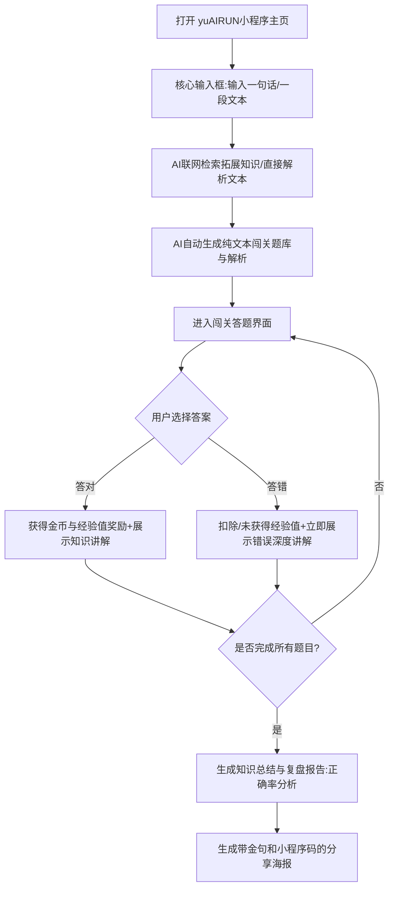

# 《yuAIRUN小程序》需求分析文档

## 人工需求分析

------

### 核心功能 MVP（按照用户操作的核心业务流程设计）

1. 用户可以自由输入一个他想学的知识（可以是一句话、一段话、甚至是一个文档 / 一个视频 / 一个网页）
2. AI 自动从全网或者特定的信息源获取知识（比如网络搜索，或者解析文档 / 视频 / 网页）
3. AI 自动生成交互式问答闯关的题目、选项和答案，通过提问引导来增加用户学习的趣味性
4. 用户可以自由答题闯关，每道题目选择后立刻给出正确答案和知识讲解（答错也有知识讲解）
5. 通关之后会生成一个知识总结和复盘报告，用户可以分享给好友
6. 用户可以在后台分析自己所学的知识和答题情况，便于日后复盘，还可以生成报告

------

### 扩展功能（后续可能会做的）

1. 允许输入知识库来生成题目（RAG）：可以用于企业培训、特定题库准备、考试复习等等
2. AI 生图，比如应用到题目和选项中：可以根据知识的类型选择是否生成图片，可以用于刷英语单词等
3. 充值 VIP 进行盈利
4. 多人对战 PK、排行榜、数字人、语音读题

## 1. 需求背景

- 核心痛点：现代学习者面临 “信息过载” 与 “学习动力不足” 的双重痛点。
- 解决方案：利用 AI 将非结构化的海量信息（文档、视频、网页）瞬间转化为结构化、趣味性的问答游戏。
- 产品定位：深度集成于微信生态的学习小程序，主打 “万物皆可闯关”。
- 核心壁垒：核心竞争力在于对用户学习流程的 “游戏化再造” 以及基于微信生态的社交裂变能力。

------

## 2. MVP 最小可行功能点

前期的目标是让用户跑通 “输入 -> 答题 -> 总结报告” 的极简闭环，确保产品轻量且开发周期极短。

- 单点知识导入：主页仅保留一个干净的输入框，用户可以自由输入一个他想学的知识（比如一句话、一段核心概念）。
- AI 引擎自动出题：AI 自动基于用户输入的一句话从全网获取知识补充，并自动生成单选题、多选题、判断题。每道题必须配备 AI 生成的深度讲解。
- 核心游戏化机制：引入 “经验值” 系统，答错会扣除 / 影响经验值获取。每关通过后，给予用户虚拟金币、经验值 (XP) 的即时奖励。
- 个人复盘与社交分享：通关后利用 AI 生成包含本次学习正确率、知识总结和掌握度百分比的复盘报告，便于日后复盘。支持生成一张包含学习金句及小程序码的精美海报供分享。

## 3. 后续扩展功能点 (按优先级排序)

|    优先级     |      功能模块      |                           详细说明                           |
| :-----------: | :----------------: | :----------------------------------------------------------: |
| P1 (输入扩展) |  多格式源信息解析  | 支持上传 PDF/Word 文档、输入网页 URL 或视频链接，AI 自动解析全文并生成题库。 |
| P1 (深度进阶) |   RAG 私有知识库   | 支持用户创建并管理多个私有文件夹，用于企业考核或考试真题模拟。 |
| P1 (用户留存) | 后台错题与分析复盘 | 结合艾宾浩斯遗忘曲线监控答错的题目，在特定天数自动触发 “旧识重温” 宝藏关卡。提供用户后台图表分析分析答题情况。 |
| P2 (社交裂变) |  社交对战与排行榜  | 支持邀请微信好友进行双人 PK，并设立按知识领域划分的全服排行榜。 |
| P2 (体验增强) |  多模态生图与交互  | 前期仅做文本，后期针对题目自动生成示意图片，或支持数字人播报、语音对答 。 |
| P3 (商业闭环) |   多元化付费模型   | 推出基础 VIP 订阅、高级 AI 解析包，以及针对超大文档的按量付费和 B2B 定制套餐。 |

## 4.用户的具体操作流程图

## 5. 需求功能核对清单

------

### 【P0】核心 MVP 阶段（跑通一句话出题闭环）

#### 基础与 AI 对接

✅ 申请并配置后端服务器与微信小程序开发者账号

✅ 编写核心 Prompt：输入一句话，大模型结合搜索生成包含题干、选项、答案、解析的 JSON 数据

✅ 落实敏感词过滤机制，确保生成的题目及解析合规

#### 前端界面开发

✅ 极简主页：仅包含一个大且醒目的输入框和一个 “开始生成” 按钮

✅ 闯关页：题目展示、选项点击逻辑，以及 “经验值” UI 展示

✅ 反馈交互：用户选择选项后立刻弹出正确答案和对应的详细知识讲解

✅ 报告与分享页：展示生成的知识总结、正确率，并利用 Canvas 拼接生成无排名的金句分享海报

✅ 微信生态：实现微信授权登录机制获取用户信息，支持海报一键保存或转发

------

### 【P1】功能扩展阶段（输入源拓宽与留存）

🔲 多源输入：接入文本抓取 API 及基础文档（PDF/Word）解析接口

🔲 个人中心分析：开发用户后台，统计历史答题情况与所学知识树，生成深度复盘报告

🔲 RAG 支持：构建向量数据库，允许输入私有知识库来生成题目

------

### 【P2-P3】高级玩法阶段（多模态与商业化）

🔲 多模态 AI：接入 AI 绘图 / 语音能力，应用到题目和选项中

🔲 社交与盈利：开发多人对战 PK、排行榜系统，以及 VIP 充值盈利系统